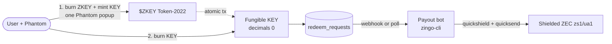
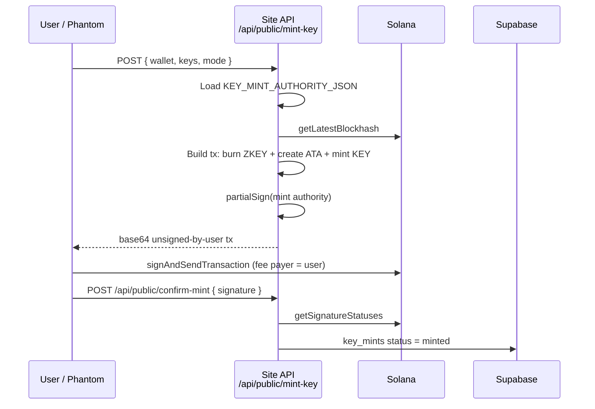
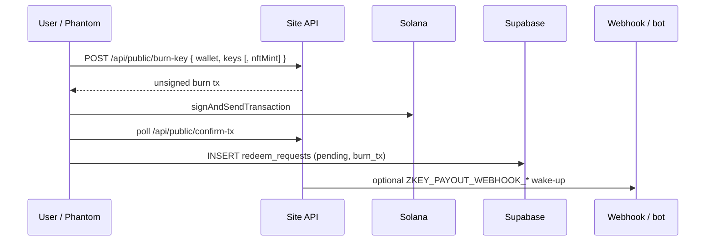
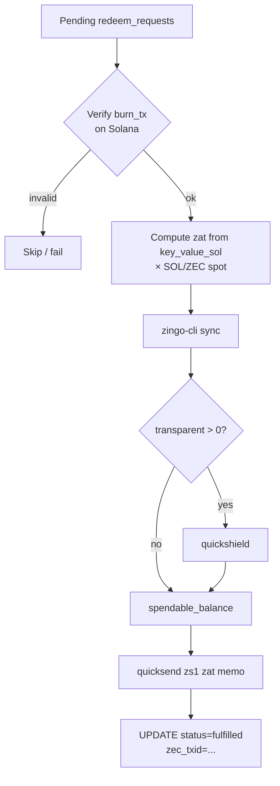
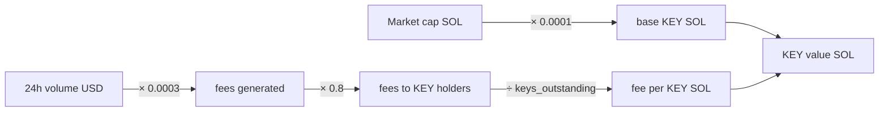

# ZKEY architecture

## High-level flow

## Step 1 — Burn ZKEY → mint KEY

- Burn amount: `keys × 250_000` $ZKEY (prod) or `keys × 10_000` (test).
- KEY mint authority secret never leaves the server.

## Step 2 — Burn KEY → queue ZEC redeem

Legacy unique KEY NFTs can be burned by passing `nftMint` (burn 1 + close ATA).

## Payout bot — KEY burn → ZEC

Treasury transparent address (public): `t1YmzzPRrdCeCniYm1naneUozLhoWf5shWi`.

## KEY value

Live MC via DexScreener (proxied by `/api/public/mc-proxy`); fees/keys snapshot in `key_metrics` (id = 1).

## Trust boundaries

| Secret | Lives in | Never in |
|---|---|---|
| `KEY_MINT_AUTHORITY_JSON` | Server env / ops host | Browser, git, VITE_* |
| `ZKEY_PAYOUT_WEBHOOK_KEY` | Server env | Browser |
| Treasury mnemonic | `TREASURY_KEY_FILE` on ops host | git, site bundle |
| Supabase service role | Bot / server only | VITE_* |

Public: mint addresses, mint-authority **pubkey**, treasury **t1** address.
